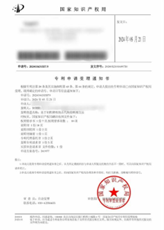
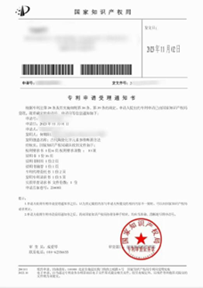
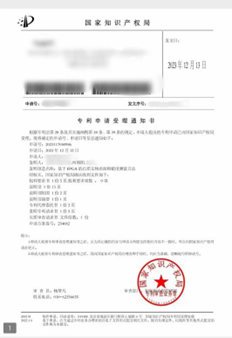
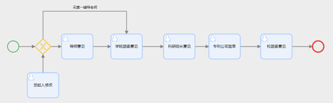
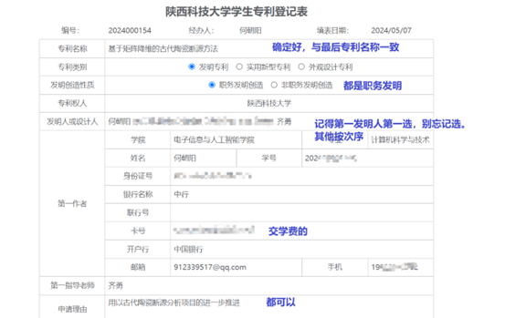
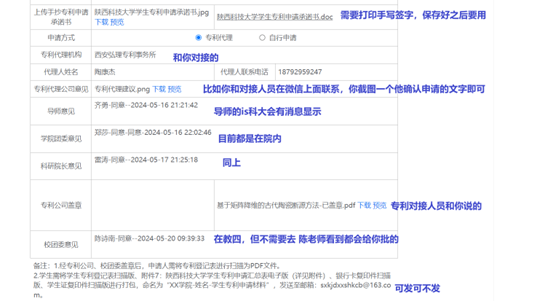
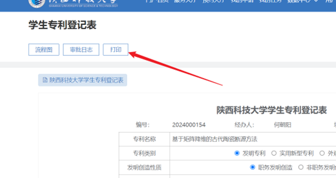

## 前言

你好，我是何朝阳。很高兴有你来阅读由我撰写的飞跃分享文档。我会在这篇文档当中来分享我大学阶段的一些经验和感悟，当然在你阅读之前，我想要提醒你一下，任何提及本质性的经验或者道理都是很简短凝练的，但凡冗余繁琐故弄玄虚者，要么是阐述者自己没有明白要么就是对你有其他意图。那么接下来，我以简短直白的文字来讲述给你。

以下是我对于“执行”的一些建议，就是怎么做的问题。但是你或许有疑问“我应该做什么？”，那如果你有类似的疑问，我希望你首先需要对于自己有一个深刻的了解，这里的深刻指的是不仅在世俗意义（背景、金钱）更多的更是在站在最内心深处自己对自己的凝视、审视、反思（这是贯穿整个人生的话题）。假如说，你对于自己喜欢什么都回答不出来；或者说，觉得我所说的感觉太烦了理解不了而排斥抵触，那么你现在可以打开抖音，多刷会吧。

1.	想到什么就去做，执行力格外重要。对于执行的管理和方式，在执行之后自然会统筹规划，对于执行的最优方案无需过于纠结。
2.	执行，你只管做就行了，其实只有在关键结点才需要他人（学长学姐、老师、长辈）的介入来引导，大部分的时间都在执行。在请教他人时，实际上已经做了很久了。
3.	当你需要他人指导之时，需要考虑他给出建议的或多或少的特异主观性，能否因地制宜“本地化”需要你思考明确。
4.	如果你90%的时间都在失败和不确定中度过，偶有灵光一现的确定和成功，这很正常。失败和不确定一直是常态，成功和确定才是偶然。

怎么个事才能做成呢？咱这事成的时候是什么状态呢？
我个人有一个想法供大家参考，这个想法与很多大佬都有不谋而合的地方。他是一种两极的状态。在一极中，我十分关切步骤的具体细节实现而对成功有十分的欲望；在另外一极中，我以长期、全局、多元来审视这件事的成功并报以“生死在命富贵由天”的拿幸态度。我将这个状态的想法分享给你，但是需要你用实践来感受他、爱护她。
如果你做到了，那么结果详看上文第4点，你的10%的小确幸会增大的。

提纯完毕。接下来我们开始专利分享。

## 个人经历

2024年5月《基于矩阵降维的古代陶瓷断源方法》发明专利                第一发明人

2023年11月《古代陶瓷化学元素多维断源方法》发明专利                 第一发明人

2023年12月《基于FPGA的石质文物表面粗糙度测量方法》发明专利        共同发明人

## 具体实操
1.	如何撰写专利

    (1)	如何构思

    (2)	如何撰写

2.	如何在陕科大发专利

    (1)	陕科大校内流程

    (2)	专利事务所流程

## 具体实操

1.1 首先你应该是有一个项目在手上，找你的指导老师来给你idea或者他给你一些现成的实例（若无，可以在网上找）。你在整个方法论上面需要有跳脱的天马星空思维。你可以做一个专利裁缝。因为专利只是方法论的阐述，任何涉及的数据可以是虚构的（非必要不虚构，要定性的正确）。那计算机上面的数据分析来举例，你可以借鉴分析结构的框架骨架来拼接；算法的实现方法来创新；不同的特性量化分析方法。说白了，你就想吧，想出来就是你的。

1.2 那么你需要你的老师帮你进行对接一个专利事务所（必须要有一个人来和你对接）。这个工作人员会给你一些模版让你根据你的专利来按照规范写（这里需要严丝合缝的、客观的阐述。这里涉及非常多的细节问题是撰写专利的最大障碍，但一通百通，如有需要私信我，我可以帮你看看）。如有涉及到绘图的情况，颜色只能是黑白。

2.1手机微信is科大-b网上办事大厅-校团委学生专利登记表-立即申请

注意：填写以上申请的时候基本上你已经快把完整稿编写完成、或者已经完成了

2.2你需要有几个打印的。
以下我会给你例子，但是一般导师也会给你。

**[点击打开例子](https://github.com/SUST-Application/sust-application.github.io/tree/master/docs/learning/research/examples.docx)**

后续需要你带着这些材料去科技处盖公章。盖完公章的文件在之后需要给到自己的专利事务所，所以要好好保管。
当然，以上的内容总共是不能覆盖到所有的东西的，在校园的四年当中还有很多的想法和经验我相信会有很多类似的帖子有所重合，所以我就暂时写专利这么多吧我后期也许会再次添加修改，如果你想在陕科大发专利可以咨询我QQ:912339517
